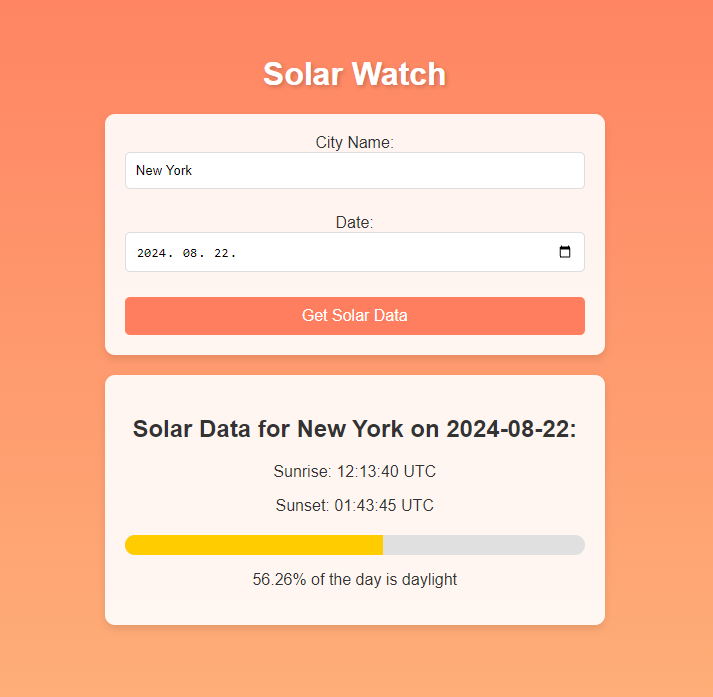


# Solar Watch Application

This project is a web application that allows users to enter a city name and a date to receive the sunrise and sunset times for that city on the specified date. The application consists of a backend web API built with .NET Core and a frontend built with React.
It also uses an SQL database to save data about cities and their corresponding sun data on a given date that has been already searched to reduce the number of API calls as much as possible.


## Project Structure

```
root
│
├── SolarWatchORM/               # .NET Core Web API project
│   ├── SolarWatchORM/           # Main application folder
│   │   ├── Controllers/         # API controllers
│   │   ├── Model/              # Data models
│   │   └── ...                  # Other backend files and directories
│   │
│   └── IntegrationTests/        # Integration tests for the application
│       └── ...                  # Test files and directories
│ 
└── SolarWatchORMReact/         # React application
    ├── src/                     # Source files
    ├── public/                  # Public files
    └── ...                      # Other frontend files and directories
```

## Prerequisites

Before you begin, make sure you have the following installed on your machine:

- [.NET Core SDK](https://dotnet.microsoft.com/download) (8.0 or later)
- [Node.js](https://nodejs.org/) (version 14 or later)
- [npm](https://www.npmjs.com/)

## Getting Started

### 1. Clone the repository

```bash
git clone https://github.com/Tommer-04/SolarWatch_PUBLIC.git
cd SolarWatch_PUBLIC
```

### 2. Set up the Backend

1. Navigate to the backend folder:

    ```bash
    cd SolarWatchORM
    cd SolarWatchORM
    ``` 
 
2. Replace the data marked with square brackets in appsettings.json with your own:
    
   ```json
    {
        "ConnectionStrings": {
            "DefaultConnection": "[YOUR_DATABASE_CONNECTION_STRING]"
        },
        "ApiKeys": {
            "CityApiKey": "[YOUR_OPENWEATHER_GEOCODING_API_KEY]"
        },
        "Jwt": {
            "ValidIssuer": "[YOUR_HOST]",
            "ValidAudience": "[YOUR_HOST]",
            "IssuerSigningKey": "[YOUR_GENERATED_SECURE_KEY]"
        }
    }
   ```

3. Install the dependencies:

    ```bash
    dotnet restore
    ```

4. Build the application:

    ```bash
    dotnet build
    ```

5. Run the application:

    ```bash
    dotnet run
    ```

   The API will be running locally on `https://localhost:7170` or `http://localhost:5035`.

### 3. Set up the Frontend
1. Navigate back to the root directory if needed:

    ```bash
    cd ..
    cd ..
    ```
2. Navigate to the frontend folder:

    ```bash
    cd ../SolarWatchORMReact
    ```


3. In the "vite.config.js" file replace the [BACKEND_URL] to url your backend is running on to make the proxy work.

4. Install the dependencies:

    ```bash
    npm install
    ```

5. Run the application:

    ```bash
    npm run dev
    ```

   The React frontend will be running locally on `http://localhost:5173`.

## Usage

1. Open your browser and navigate to `http://localhost:5173`.
2. Register and Login to access the solar watch.
3. Enter a city name and a date in the input fields and submit it to retrieve data.

## API Endpoint

The backend API exposes the following endpoint to get the solar data:

- `GET /api/SolarWatch/getData?CityName={cityName}&Date={yyyy-MM-dd}`: Returns the sunrise and sunset times for the specified city on the specified date.

## License

This project is licensed under the MIT License. See the [LICENSE](LICENSE) file for more details.

## Contributing

Contributions are welcome! Please open an issue or submit a pull request for any changes.
